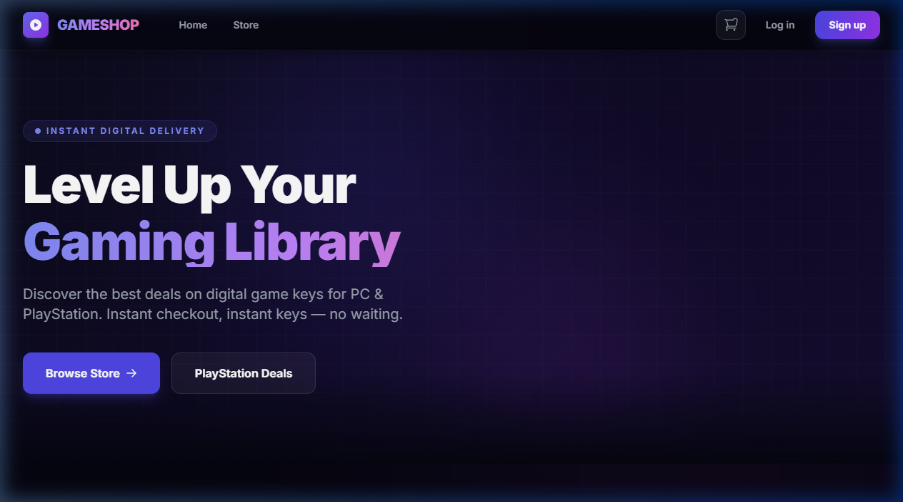
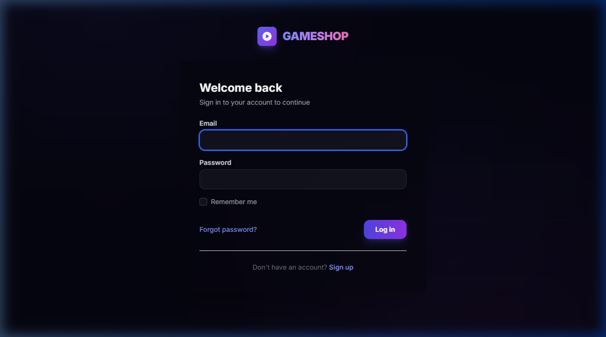
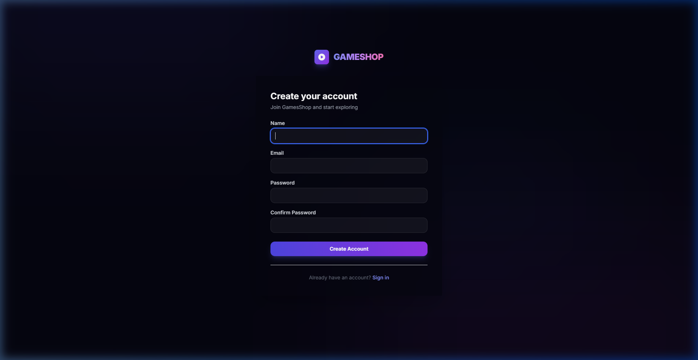
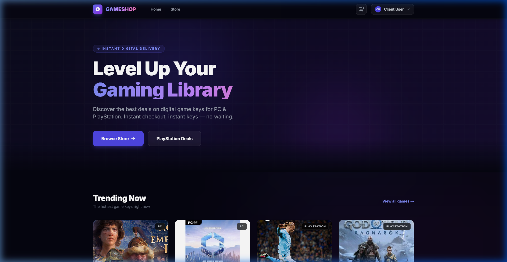
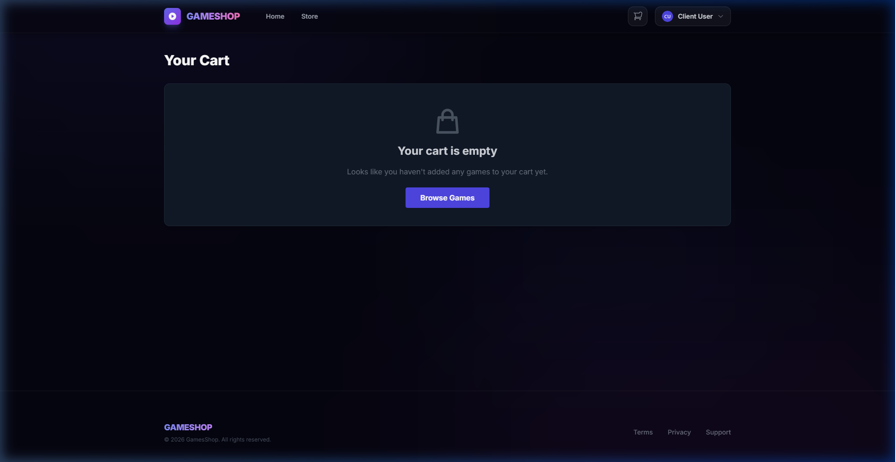
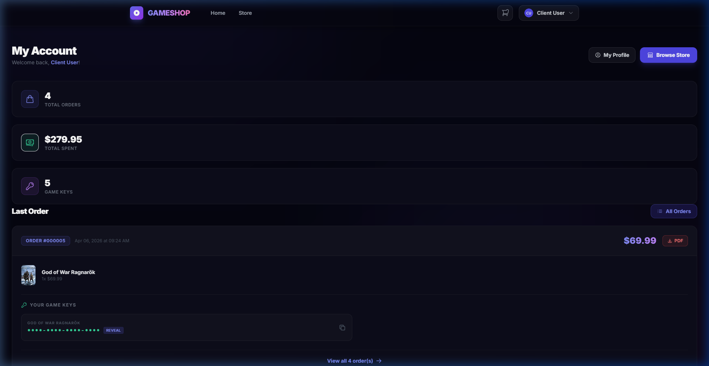
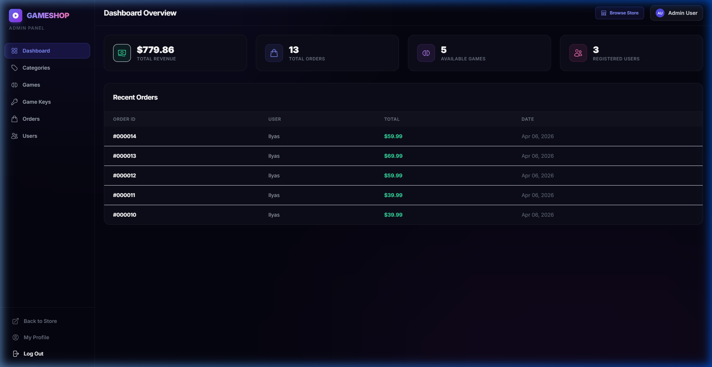
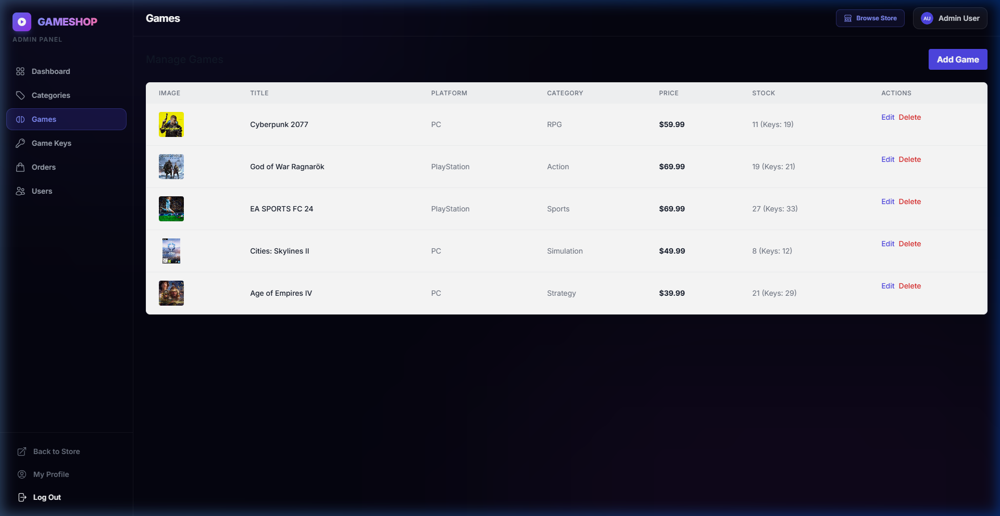
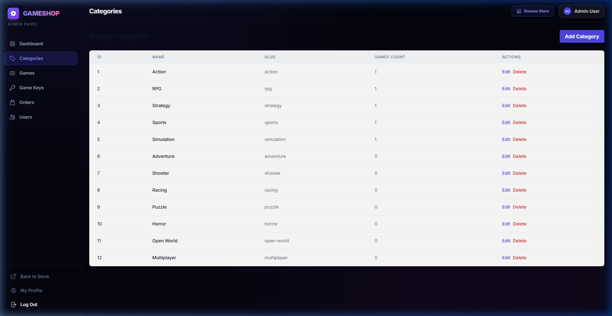
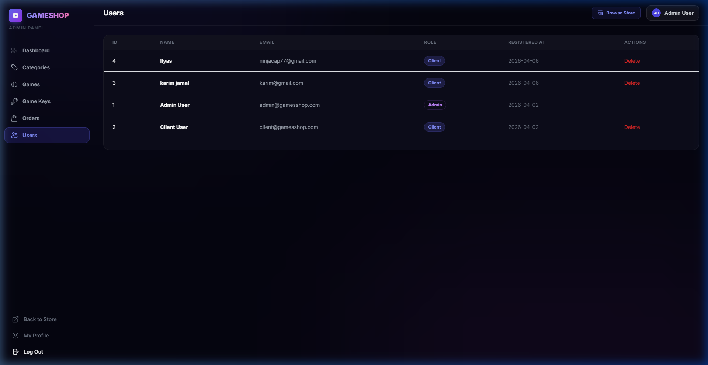

# GamesShop - E-Commerce Platform

A production-quality digital video game key e-commerce platform built with Laravel. This project includes secure authentication, game management, a shopping cart, checkout simulation, and an admin dashboard.

## 📸 Screenshots

### 🏠 Store Homepage


### 🔐 Authentication
| Login | Register |
|-------|----------|
|  |  |

### 🛒 Client Storefront
| Browse Games | Shopping Cart | My Account / Orders |
|---|---|---|
|  |  |  |

### 🛡️ Admin Panel
| Dashboard | Games Management |
|---|---|
|  |  |

| Categories | Users |
|---|---|
|  |  |

---

## 🚀 Prerequisites

Before you begin, ensure you have the following installed on your new PC:
- **PHP** (v8.1 or higher)
- **Composer** (PHP dependency manager)
- **Node.js & npm** (JavaScript runtime and package manager)
- **MySQL** (via XAMPP, WAMP, or Laragon)

## 🛠️ Installation & Setup Guide

Follow these steps to get the project running on a new machine:

### 1. Extract the Project
Place the `GamesShop` project folder in your desired directory (e.g., `htdocs` if using XAMPP, or anywhere on your PC if using `php artisan serve`).

### 2. Install Backend Dependencies
Open a terminal inside the project folder (`GamesShop`) and run:
```bash
composer install
```

### 3. Install Frontend Dependencies
Then, install the necessary frontend packages:
```bash
npm install
```

### 4. Environment Configuration
- Duplicate the `.env.example` file and rename the copy to `.env`.
> *Note: If you copied the entire folder including hidden files, the `.env` file might already exist. If so, simply edit it.*

- Open the `.env` file and update your database credentials to match the database on your new PC:
```env
DB_CONNECTION=mysql
DB_HOST=127.0.0.1
DB_PORT=3306
DB_DATABASE=games_shop  # The database name you will create
DB_USERNAME=root        # Usually 'root' for local environments
DB_PASSWORD=            # Leave empty if there is no password
```

### 5. Create the Database
Open **phpMyAdmin** (or your preferred MySQL client) and create a new empty database with the same name you used in the `.env` file (e.g., `games_shop`).

### 6. Generate Application Key
Generate a new secure key for the Laravel application:
```bash
php artisan key:generate
```

### 7. Run Migrations & Seeders
Set up the database tables and insert the initial data (games, categories, users):
```bash
php artisan migrate --seed
```

### 8. Link Storage
Create a symbolic link so the application can properly display uploaded images and PDFs:
```bash
php artisan storage:link
```

## 🎮 Running the Application

To run the application locally, you will need **two separate terminal windows** open in the project folder.

**Terminal 1:** Run the Vite development server (compiles CSS/JS and enables live-reloading):
```bash
npm run dev
```

**Terminal 2:** Run the Laravel backend server:
```bash
php artisan serve
```

The application will now be accessible at: **[http://127.0.0.1:8000](http://127.0.0.1:8000)**

## 🔐 Typical Default Credentials

If the database seeders (`DatabaseSeeder.php`) included default user accounts, you can usually log in with:
- **Admin Email**: `admin@admin.com` (or check your seeder files)
- **Password**: `password`
